# 01 - K8S Basic

- [01 - K8S Basic](#01---k8s-basic)
  - [Basic Kubectl - Pods](#basic-kubectl---pods)
    - [List Running Pods](#list-running-pods)
    - [Run Pods using public image](#run-pods-using-public-image)
    - [Get Pod configurations](#get-pod-configurations)
    - [Show running pods](#show-running-pods)
    - [Remove pods](#remove-pods)
  - [Manifest](#manifest)
    - [Create pods using fanifest](#create-pods-using-fanifest)
    - [Edit pod configurations](#edit-pod-configurations)
  - [ReplicationController](#replicationcontroller)
  - [ReplicaSets](#replicasets)
    - [Run ReplicaSet](#run-replicaset)
    - [Use of `label` in Replicaset](#use-of-label-in-replicaset)
    - [Delete ReplicaSet & the corresponding resources](#delete-replicaset--the-corresponding-resources)
  - [Deployment](#deployment)
    - [Skeleton](#skeleton)
    - [Commands](#commands)
  - [Namespaces](#namespaces)
    - [Commands](#commands-1)
    - [YAML](#yaml)
    - [Changing current Namespace context](#changing-current-namespace-context)
    - [Resource Quota](#resource-quota)
  - [Services](#services)
    - [NodePort](#nodeport)
    - [Service Cluster IP](#service-cluster-ip)
    - [Service - Load Balancer](#service---load-balancer)
  - [Imperative vs. Declarative](#imperative-vs-declarative)
    - [Imperative Object Configuration files](#imperative-object-configuration-files)
    - [Declarative](#declarative)
  - [Kubectl apply](#kubectl-apply)

----

## Basic Kubectl - Pods

### List Running Pods

To list running pods:

```
kubectl get pods
```

<br/>

### Run Pods using public image

To run a pod named `nginx` using the image `nginx` from Dockerhub:

```
kubectl run nginx --image=nginx
```

<br/>

### Get Pod configurations

To get the configuration about a pod:

```
kubectl describe pod <POD_NAME>

kubectl describe pod <POD_NAME> | grep -i image
```


To get the configuration in `YAML` format:

```
kubectl get pod <POD_NAME> -o yaml

kubectl get pod <POD_NAME> -o yaml | grep -i image
```

<br/>

### Show running pods

To show more information about the running pods in table format:

```
kubectl get pods -o wide
```

Alternatively you can check the pod detail:

```
kubectl get pod <POD_NAME> -o yaml | grep -i nodeName
```

<br/>

### Remove pods

To delete a pod:

```
kubectl delete pod <POD_NAME>
```

<br/>

---

## Manifest

To create a skeleton `YAML` file:

```
kubectl run <POD_NAME> --image=<IMAGE_NAME> --dry-run=client -o yaml > pod.yaml
```

The output will be something like this:

```
apiVersion: v1
kind: Pod
metadata:
  creationTimestamp: null
  labels:
    run: redis
  name: redis
spec:
  containers:
  - image: redis123
    name: redis
    resources: {}
  dnsPolicy: ClusterFirst
  restartPolicy: Always
status: {}
```

<br/>

### Create pods using fanifest

To create a pod using a fanifest:

```
kubectl create -f <MANIFEST.yaml>

OR

kubectl apply -f <MANIFEST.yaml>
```

<br/>

### Edit pod configurations

To edit an existing pod's configuration:

```
kubectl edit pod <POD_NAME>
```

After editing, K8S will try to re-run using the new configuration.

<br/>

---

## ReplicationController

Used for resilience / ensure the desired state.

<br/>

**ReplicationController**

Skeleton:
- Note the `apiVersion` is `v1`

```
apiVersion: v1
kind: ReplicationController
metadata:
  name: myapp-rc
  labels:
    app: myapp
    type: front-end
spec:
  template:
    <POD_CONFIG>
  replicas: <NUMBER>
```

Example:

```
apiVersion: v1
kind: ReplicationController
metadata:
  name: myapp-rc
  labels:
    app: myapp
    type: front-end
spec:
  template:
    metadatta:  
      name: myapp-pod
      labels:
        app: myapp
        type: front-end
    spec:
      containers:
        - name: nginx-container
          image: nginx
  replicas: 3
```

<br/>

To create a replica set using a `YAML`:

```
kubectl create -f <RC-CONFIG.yaml>
```

<br/>

To view running replicationcontroller:

```
kubectl get replicationcontroller
```

<br/>

You can also see the running pods created by the replication controller:

```
kubectl get pods
```

<br/>

---

## ReplicaSets

<br/>

```
kubectl get replicaset

kubectl describe replicaset <REPLICASET_NAME>

kubectl delete replicaset <REPLICASET_NAME>
```

<br/>

ReplicaSet skeleton (major difference: `spec.selector`)
- Note the `apiVersion` is `apps/v1`

```
apiVersion: apps/v1
kind: ReplicaSet
metadata:
  name: myapp-replicaset
  labels:
    app: myapp
    type: front-end
spec:
  template:
    <POD_CONFIG>
  replicas: <NUMBER>
  selector: 
    matchLabels:
      type: front-end
```

<br/>

Example:

```
apiVersion: apps/v1
kind: ReplicaSet
metadata:
  name: myapp-replicaset
  labels:
    app: myapp
    type: front-end
spec:
  template:
    metadatta:  
      name: myapp-pod
      labels:
        app: myapp
        type: front-end
    spec:
      containers:
        - name: nginx-container
          image: nginx
  replicas: 3
  selector: 
    matchLabels:
      type: front-end
```

<br/>

### Run ReplicaSet

To run a ReplicaSet using `kubectl`:

```
kubectl create -f <ReplicaSet.yaml>
```

<br/>

```
kubectl get replicaset
kubectl get pods
```

<br/>

### Use of `label` in Replicaset

Note **ReplicaSet** uses the `label` filter to monitor the pods.

To scale:

- Method 1: Change the `replica` number in the manifest and run 
  - `kubectl replace -f <manifest.yml>

- Method 2: Use the `scale` command with `--replicas` option
  - `kubectl scale --replicas=6 -f <manifest.yml>`
  - `kubectl scale --replicas=6 replicaset <REPLICASET_NAME>`

<br/>

### Delete ReplicaSet & the corresponding resources

To remove a replicaset & delete all underlying Pods:

```
kubectl delete replicaset <REPLICASET_NAME>
```

<br/>

---

## Deployment

High-level idea:
- Deployment
    - ReplicaSet
      - Pods

Different deployment methods:
- Blue-Green deployment


### Skeleton

```
apiVersion: apps/v1
kind: Deployment
metadata:
  name: myapp-deployment
  labels:
    name: my-app
    type: front-end
spec:
  template:
    metadata:
      name: myapp-pod
      labels:
        app: myapp
        type: front-end
    spec:
      containers:
      - name: nginx-container
        image: nginx
  replicas: 3
  selector:
    matchLabels:
      type: front-end
```

<br/>

### Commands

```
kubectl create -f <DEPLOYMENT.yaml>

kubectl get all

kubectl get deployments

kubectl get replicaset

kubectl get pods

```

---

## Namespaces

By default, we are using the default namespace called `Default`.

Additionally, by default there are 2 more:
- kube-system
- kube-public

<br/>

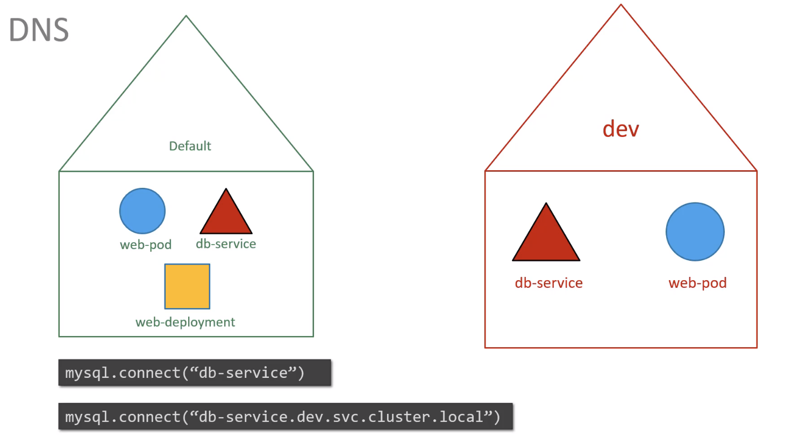  

<br/>

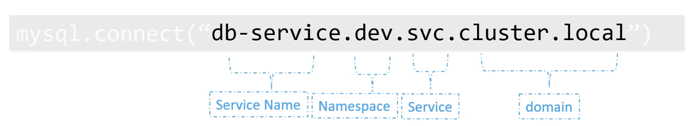  

<br/>

### Commands

```
kubectl get pods

kubectl get pods --namespace=<NAMESPACE>

kubectl create -f <MANIFEST.yaml> --namespace=<NAMESPACE>
```

<br/>

### YAML

To create a namespace in a manifest:

```
apiVersion: v1
kind: Namespace
metadata:
  name: <NAMESPACE>
```

<br/>

Then create namespace using:

```
kubectl create -f <NAMESPACE_MANIFEST.yml>
```

Alternatively:

```
kubectl create namespace <NAMESPACE>
```

<br/>

### Changing current Namespace context

```
kubectl config set-context $(kubectl config current-context) --namespace=<NAMESPACE>
```

Then you will be getting / intereacting with the resources in the `NAMESPACE` specified without using the flag `--namespace`.

<br/>

To get all pods in all namespaces:

```
kubectl get pods --all-namespaces
```

<br/>

### Resource Quota

We can also restrict the resources (e.g. number of pods / number of nodes) in a namespace using the `kind` of `ResourceQuota`:

```
apiVersion: v1
kind: ResourceQuota
metadata:
  name: compute-quota
  namespace: <NAMESPACE>
```

<br/>

Example:

```
apiVersion: v1
kind: ResourceQuota
metadata:
  name: compute-quota
  namespace: dev
spec:
  hard:
    pods: "10"
    requests.cpu: "4"
    requests.memory: 5Gi
    limits.cpu: "10"
    limits.memory: 10Gi
```

<br/>

Then to create the ResourceQuota:

```
kubectl create -f <ResourceQuotaManifest.yaml>
```

<br/>

---

## Services

Connect applications together. e.g. Front-end + Back-end

  

<br/>

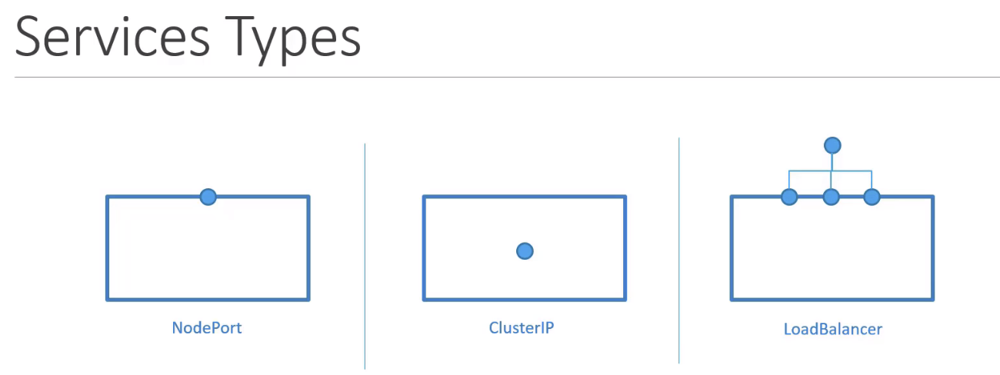  

<br/>

### NodePort

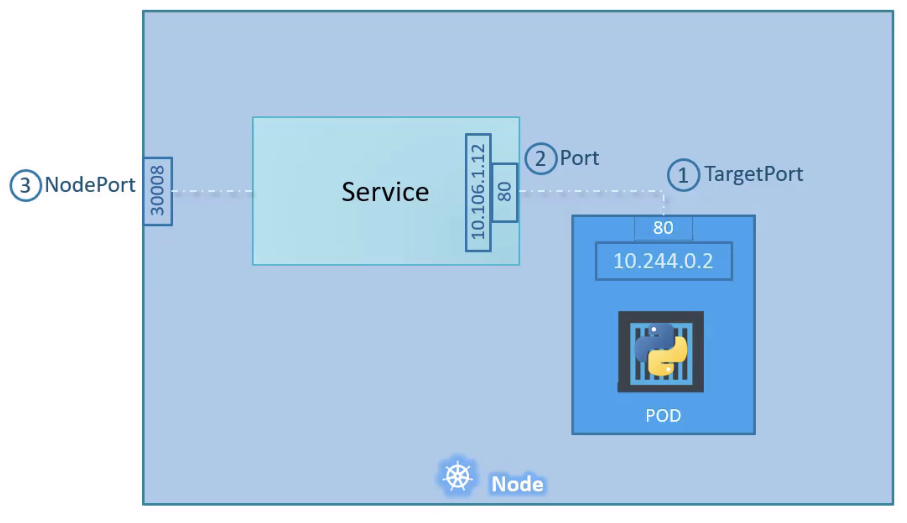  

- The node forwards incoming traffic to Pod. 
- Note node port only available from `30000 - 32767`.

<br/>

Manifest:

```
apiVersion: v1
kind: Service
metadata:
  name: myapp-service

spec:
  type: NodePort
  ports:
    - targetPort: 80
      port: 80
      nodePort: 30008
  selector:
    app: myapp
    type: front-end
```

- Selector is used to map the Pods

<br/>

To create a service:

```
kubectl create -f <SERVICE_MANIFEST.yml>
```

<br/>

To check the service created:

```
kubectl get services
```

<br/>

Alternatively, we can use:

```
kubectl expose deployment <DEPLOYMENT_NAME> --name=<SERVICE_NAME> --target-port=<TARGET_PORT> --type=<SERVICE_TYPE> --dry-run=client -o yaml > service.yaml
```

<br/>

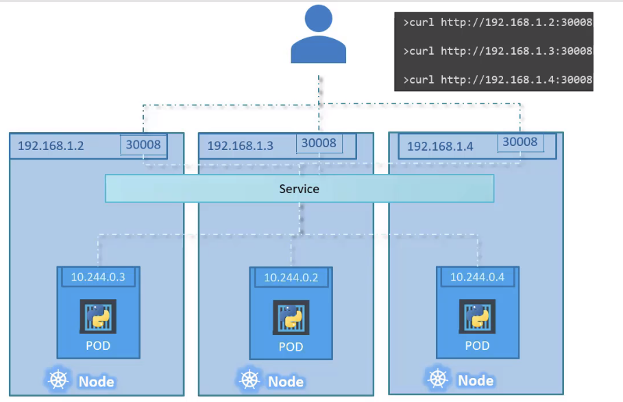  

<br/>

### Service Cluster IP

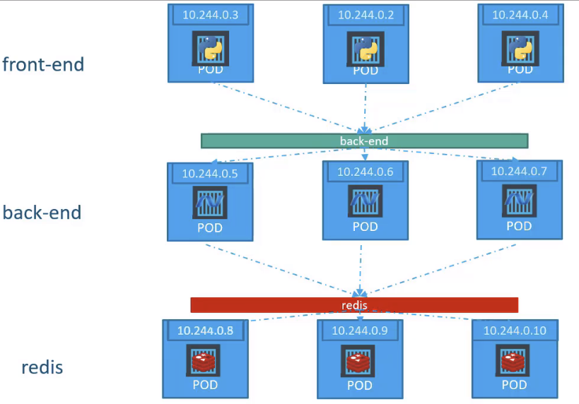  

- Provide abstractions of the backend service ports

<br/>

Manifest:

```
apiVersion: v1
kind: Service
metadata:
  name: backend

spec:
  type: ClusterIP
  ports:
  - targetPort: 80
    port: 80
  selector:
    app: myapp
    type: backend
```

<br/>

To create the service:

```
kubectl create -f service-definition.yml
```

<br/>

### Service - Load Balancer

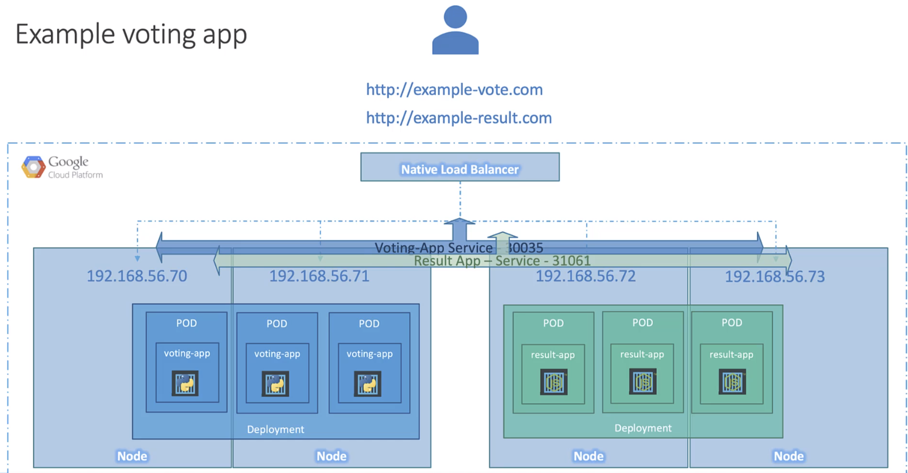  

<br/>

For supported Cloud Platform, we can use the following Manifest:

```
apiVersion: v1
kind: Service
metadata:
  name: myapp-service

spec:
  type:  LoadBalancer
  ports:
    - targetPort: 80
      port: 80
      nodePort: 30008
```

<br/>

---

## Imperative vs. Declarative

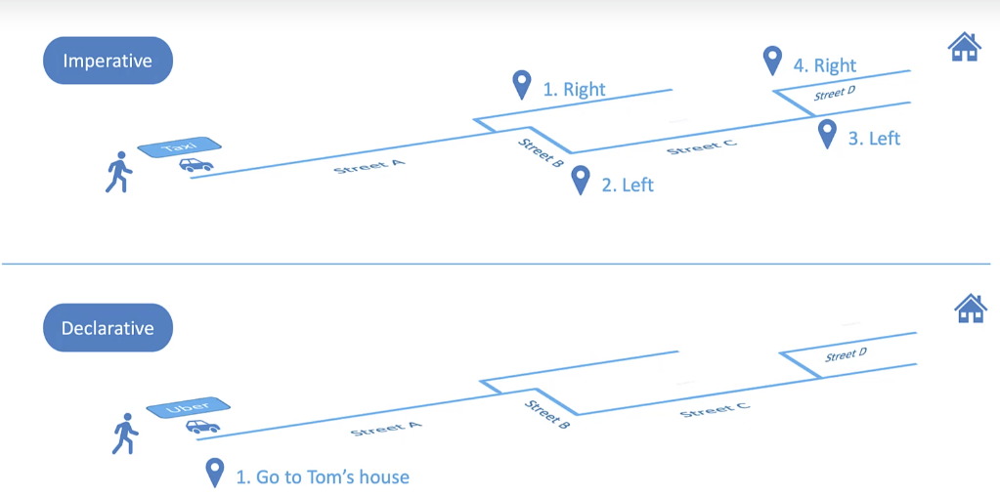  


In Infrastructure-as-Code world:

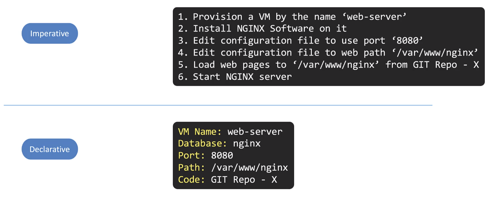  

Declarative:
- Chef
- Ansible
- Terraform
- ...

<br/>

In Kubernetes world:

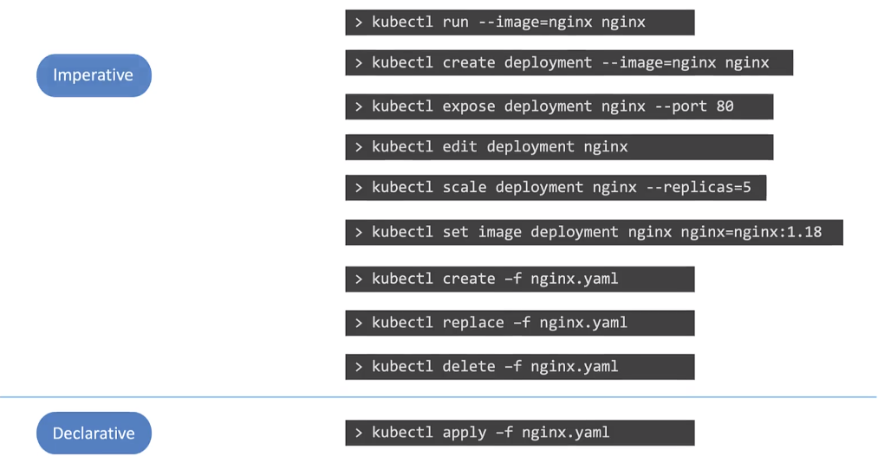  

<br/>

### Imperative Object Configuration files

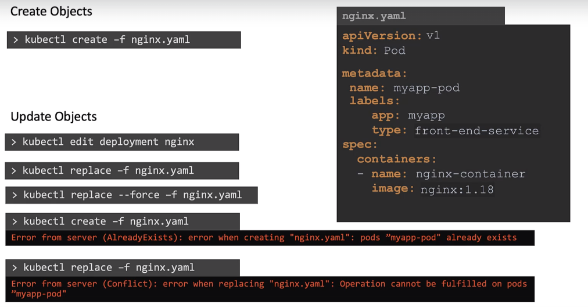  

- Use `kubectl create` / `kubectl replace` ...

<br/>

### Declarative

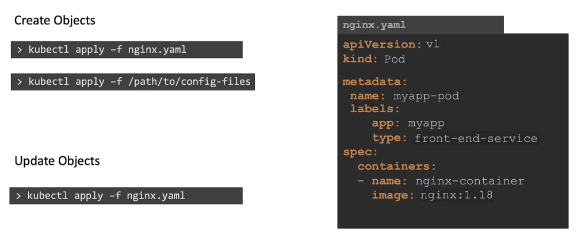  

- Use `kubectl apply`

<br/>

While you would be working mostly the declarative way - using definition files, imperative commands can help in getting one time tasks done quickly, as well as generate a definition template easily. This would help save a considerable amount of time during your exams.

<br/>

Before we begin, familiarize with the two options that can come in handy while working with the below commands:

- `--dry-run`: By default as soon as the command is run, the resource will be created. If you simply want to test your command, use the `--dry-run=client` option. This will not create the resource, instead, tell you whether the resource can be created and if your command is right.
- `-o yaml`: This will output the resource definition in YAML format on the screen.

<br/>

Use the above two in combination to generate a resource definition file quickly, that you can then modify and create resources as required, instead of creating the files from scratch.

<br/>

**POD**

Create an NGINX Pod
```
kubectl run nginx --image=nginx
```

Generate POD Manifest YAML file (`-o yaml`). Don't create it(`--dry-run`)

```
kubectl run nginx --image=nginx  --dry-run=client -o yaml
```

<br/>

**Deployment**

Create a deployment

```
kubectl create deployment --image=nginx nginx
```


Generate Deployment YAML file (-o yaml). Don't create it(--dry-run)

```
kubectl create deployment --image=nginx nginx --dry-run -o yaml
```


Generate Deployment with 4 Replicas

```
kubectl create deployment nginx --image=nginx --replicas=4
```

You can also scale a deployment using the kubectl scale command.

```
kubectl scale deployment nginx --replicas=4
```


Another way to do this is to save the YAML definition to a file.

```
kubectl create deployment nginx --image=nginx--dry-run=client -o yaml > nginx-deployment.yaml
```

You can then update the YAML file with the replicas or any other field before creating the deployment.

<br/>

**Service**

Create a Service named redis-service of type ClusterIP to expose pod redis on port 6379

```
kubectl expose pod redis --port=6379 --name redis-service --dry-run=client -o yaml
```

(This will automatically use the pod's labels as selectors)

Or

```
kubectl create service clusterip redis --tcp=6379:6379 --dry-run=client -o yaml  
```

(This will not use the pods labels as selectors, instead it will assume selectors as app=redis. You cannot pass in selectors as an option. So it does not work very well if your pod has a different label set. So generate the file and modify the selectors before creating the service)

<br/>

Create a Service named nginx of type NodePort to expose pod nginx's port 80 on port 30080 on the nodes:

```
kubectl expose pod nginx --port=80 --name nginx-service --type=NodePort --dry-run=client -o yaml
```
(This will automatically use the pod's labels as selectors, but you cannot specify the node port. You have to generate a definition file and then add the node port in manually before creating the service with the pod.)

<br/>

OR

```
kubectl create service nodeport nginx --tcp=80:80 --node-port=30080 --dry-run=client -o yaml
```

(This will not use the pods labels as selectors)

Both the above commands have their own challenges. While one of it cannot accept a selector the other cannot accept a node port. I would recommend going with the `kubectl expose` command. If you need to specify a node port, generate a definition file using the same command and manually input the nodeport before creating the service.

<br/>

Reference:

https://kubernetes.io/docs/reference/kubectl/conventions/

<br/>

---

## Kubectl apply

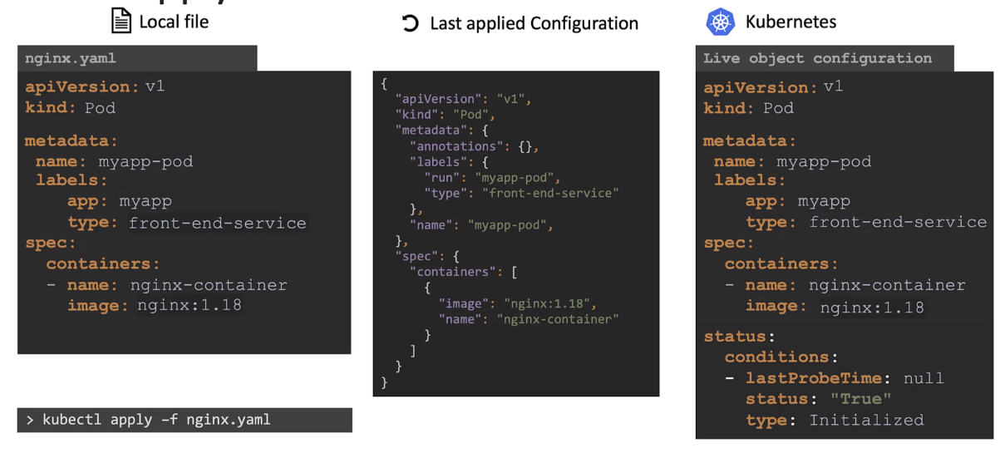  

<br/>

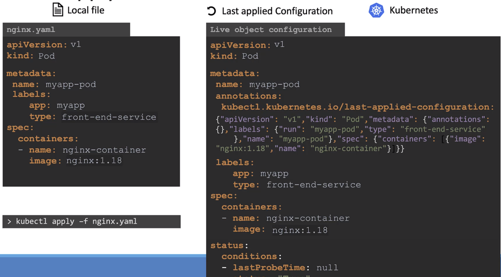  

<br/>

