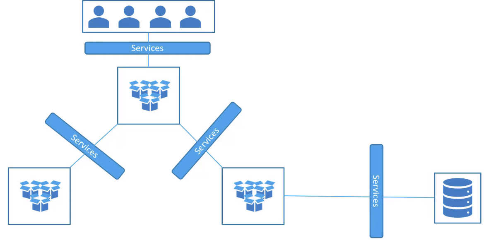

# 01 - K8S Basic

- [01 - K8S Basic](#01---k8s-basic)
  - [Basic Kubectl - Pods](#basic-kubectl---pods)
    - [List Running Pods](#list-running-pods)
    - [Run Pods using public image](#run-pods-using-public-image)
    - [Get Pod configurations](#get-pod-configurations)
    - [Show running pods](#show-running-pods)
    - [Remove pods](#remove-pods)
  - [Manifest](#manifest)
    - [Create pods using fanifest](#create-pods-using-fanifest)
    - [Edit pod configurations](#edit-pod-configurations)
  - [ReplicationController](#replicationcontroller)
  - [ReplicaSets](#replicasets)
    - [Run ReplicaSet](#run-replicaset)
    - [Use of `label` in Replicaset](#use-of-label-in-replicaset)
    - [Delete ReplicaSet & the corresponding resources](#delete-replicaset--the-corresponding-resources)
  - [Deployment](#deployment)
    - [Skeleton](#skeleton)
    - [Commands](#commands)
  - [Namespaces](#namespaces)
    - [Commands](#commands-1)
    - [YAML](#yaml)
    - [Changing current Namespace context](#changing-current-namespace-context)
    - [Resource Quota](#resource-quota)
  - [Services](#services)
    - [NodePort](#nodeport)

----

## Basic Kubectl - Pods

### List Running Pods

To list running pods:

```
kubectl get pods
```

<br/>

### Run Pods using public image

To run a pod named `nginx` using the image `nginx` from Dockerhub:

```
kubectl run nginx --image=nginx
```

<br/>

### Get Pod configurations

To get the configuration about a pod:

```
kubectl describe pod <POD_NAME>

kubectl describe pod <POD_NAME> | grep -i image
```


To get the configuration in `YAML` format:

```
kubectl get pod <POD_NAME> -o yaml

kubectl get pod <POD_NAME> -o yaml | grep -i image
```

<br/>

### Show running pods

To show more information about the running pods in table format:

```
kubectl get pods -o wide
```

Alternatively you can check the pod detail:

```
kubectl get pod <POD_NAME> -o yaml | grep -i nodeName
```

<br/>

### Remove pods

To delete a pod:

```
kubectl delete pod <POD_NAME>
```

<br/>

---

## Manifest

To create a skeleton `YAML` file:

```
kubectl run <POD_NAME> --image=<IMAGE_NAME> --dry-run=client -o yaml > pod.yaml
```

The output will be something like this:

```
apiVersion: v1
kind: Pod
metadata:
  creationTimestamp: null
  labels:
    run: redis
  name: redis
spec:
  containers:
  - image: redis123
    name: redis
    resources: {}
  dnsPolicy: ClusterFirst
  restartPolicy: Always
status: {}
```

<br/>

### Create pods using fanifest

To create a pod using a fanifest:

```
kubectl create -f <MANIFEST.yaml>

OR

kubectl apply -f <MANIFEST.yaml>
```

<br/>

### Edit pod configurations

To edit an existing pod's configuration:

```
kubectl edit pod <POD_NAME>
```

After editing, K8S will try to re-run using the new configuration.

<br/>

---

## ReplicationController

Used for resilience / ensure the desired state.

<br/>

**ReplicationController**

Skeleton:
- Note the `apiVersion` is `v1`

```
apiVersion: v1
kind: ReplicationController
metadata:
  name: myapp-rc
  labels:
    app: myapp
    type: front-end
spec:
  template:
    <POD_CONFIG>
  replicas: <NUMBER>
```

Example:

```
apiVersion: v1
kind: ReplicationController
metadata:
  name: myapp-rc
  labels:
    app: myapp
    type: front-end
spec:
  template:
    metadatta:  
      name: myapp-pod
      labels:
        app: myapp
        type: front-end
    spec:
      containers:
        - name: nginx-container
          image: nginx
  replicas: 3
```

<br/>

To create a replica set using a `YAML`:

```
kubectl create -f <RC-CONFIG.yaml>
```

<br/>

To view running replicationcontroller:

```
kubectl get replicationcontroller
```

<br/>

You can also see the running pods created by the replication controller:

```
kubectl get pods
```

<br/>

---

## ReplicaSets

<br/>

```
kubectl get replicaset

kubectl describe replicaset <REPLICASET_NAME>

kubectl delete replicaset <REPLICASET_NAME>
```

<br/>

ReplicaSet skeleton (major difference: `spec.selector`)
- Note the `apiVersion` is `apps/v1`

```
apiVersion: apps/v1
kind: ReplicaSet
metadata:
  name: myapp-replicaset
  labels:
    app: myapp
    type: front-end
spec:
  template:
    <POD_CONFIG>
  replicas: <NUMBER>
  selector: 
    matchLabels:
      type: front-end
```

<br/>

Example:

```
apiVersion: apps/v1
kind: ReplicaSet
metadata:
  name: myapp-replicaset
  labels:
    app: myapp
    type: front-end
spec:
  template:
    metadatta:  
      name: myapp-pod
      labels:
        app: myapp
        type: front-end
    spec:
      containers:
        - name: nginx-container
          image: nginx
  replicas: 3
  selector: 
    matchLabels:
      type: front-end
```

<br/>

### Run ReplicaSet

To run a ReplicaSet using `kubectl`:

```
kubectl create -f <ReplicaSet.yaml>
```

<br/>

```
kubectl get replicaset
kubectl get pods
```

<br/>

### Use of `label` in Replicaset

Note **ReplicaSet** uses the `label` filter to monitor the pods.

To scale:

- Method 1: Change the `replica` number in the manifest and run 
  - `kubectl replace -f <manifest.yml>

- Method 2: Use the `scale` command with `--replicas` option
  - `kubectl scale --replicas=6 -f <manifest.yml>`
  - `kubectl scale --replicas=6 replicaset <REPLICASET_NAME>`

<br/>

### Delete ReplicaSet & the corresponding resources

To remove a replicaset & delete all underlying Pods:

```
kubectl delete replicaset <REPLICASET_NAME>
```

<br/>

---

## Deployment

High-level idea:
- Deployment
    - ReplicaSet
      - Pods

Different deployment methods:
- Blue-Green deployment


### Skeleton

```
apiVersion: apps/v1
kind: Deployment
metadata:
  name: myapp-deployment
  labels:
    name: my-app
    type: front-end
spec:
  template:
    metadata:
      name: myapp-pod
      labels:
        app: myapp
        type: front-end
    spec:
      containers:
      - name: nginx-container
        image: nginx
  replicas: 3
  selector:
    matchLabels:
      type: front-end
```

<br/>

### Commands

```
kubectl create -f <DEPLOYMENT.yaml>

kubectl get all

kubectl get deployments

kubectl get replicaset

kubectl get pods

```

---

## Namespaces

By default, we are using the default namespace called `Default`.

Additionally, by default there are 2 more:
- kube-system
- kube-public

<br/>

  

<br/>

  

<br/>

### Commands

```
kubectl get pods

kubectl get pods --namespace=<NAMESPACE>

kubectl create -f <MANIFEST.yaml> --namespace=<NAMESPACE>
```

<br/>

### YAML

To create a namespace in a manifest:

```
apiVersion: v1
kind: Namespace
metadata:
  name: <NAMESPACE>
```

<br/>

Then create namespace using:

```
kubectl create -f <NAMESPACE_MANIFEST.yml>
```

Alternatively:

```
kubectl create namespace <NAMESPACE>
```

<br/>

### Changing current Namespace context

```
kubectl config set-context $(kubectl config current-context) --namespace=<NAMESPACE>
```

Then you will be getting / intereacting with the resources in the `NAMESPACE` specified without using the flag `--namespace`.

<br/>

To get all pods in all namespaces:

```
kubectl get pods --all-namespaces
```

<br/>

### Resource Quota

We can also restrict the resources (e.g. number of pods / number of nodes) in a namespace using the `kind` of `ResourceQuota`:

```
apiVersion: v1
kind: ResourceQuota
metadata:
  name: compute-quota
  namespace: <NAMESPACE>
```

<br/>

Example:

```
apiVersion: v1
kind: ResourceQuota
metadata:
  name: compute-quota
  namespace: dev
spec:
  hard:
    pods: "10"
    requests.cpu: "4"
    requests.memory: 5Gi
    limits.cpu: "10"
    limits.memory: 10Gi
```

<br/>

Then to create the ResourceQuota:

```
kubectl create -f <ResourceQuotaManifest.yaml>
```

<br/>

---

## Services

Connect applications together. e.g. Front-end + Back-end

  

<br/>

  

<br/>

### NodePort

  

- The node forwards incoming traffic to Pod. 
- Note node port only available from `30000 - 32767`.

<br/>

Manifest:

```
apiVersion: v1
kind: Service
metadata:
  name: myapp-service

spec:
  type: NodePort
  ports:
    - targetPort: 80
      port: 80
      nodePort: 30008
  selector:
    app: myapp
    type: front-end
```

- Selector is used to map the Pods

<br/>

To create a service:

```
kubectl create -f <SERVICE_MANIFEST.yml>
```

<br/>

To check the service created:

```
kubectl get services
```

<br/>

  

<br/>

