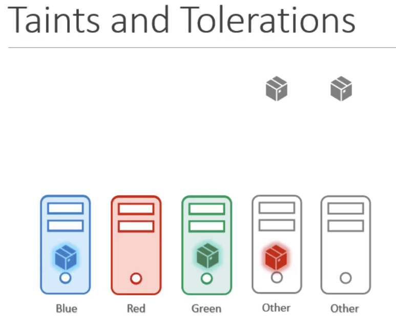
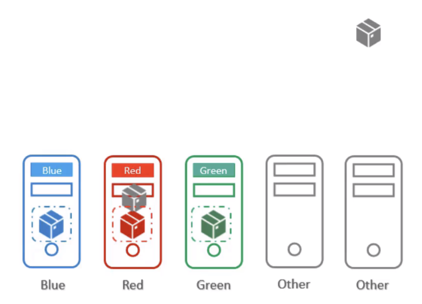
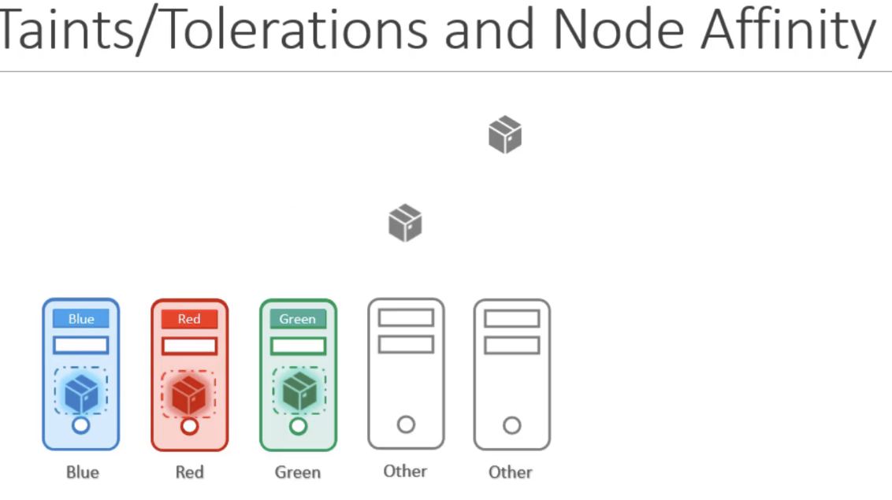
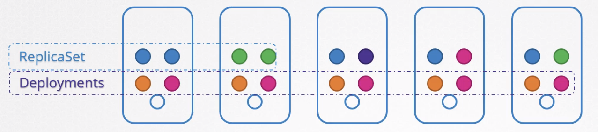
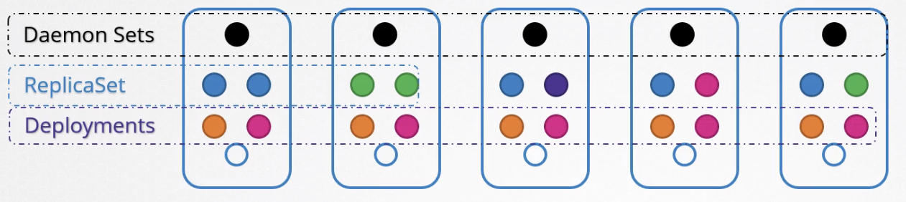
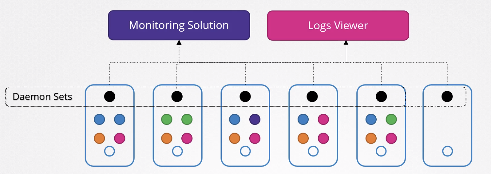

# 02 - Scheduler 

- [02 - Scheduler](#02---scheduler)
  - [Manual Scheduling](#manual-scheduling)
  - [Labels & Selectors](#labels--selectors)
    - [Labels & Replicaset](#labels--replicaset)
    - [Annotations](#annotations)
    - [Taint](#taint)
  - [Node Selectors](#node-selectors)
  - [Node Affinity](#node-affinity)
    - [Node Affinity Types](#node-affinity-types)
  - [Taints and Tolerations vs. Node Affinity](#taints-and-tolerations-vs-node-affinity)
  - [Resoruce Requirements and Limits](#resoruce-requirements-and-limits)
    - [Resource Limits](#resource-limits)
    - [Default reosurce requirements and limits](#default-reosurce-requirements-and-limits)
  - [Daemon Sets](#daemon-sets)

---

## Manual Scheduling

In a Pod manifest, if `nodeName` is not defined, **Scheduler** will see which node to schedule and bind the Pod to run in a specific node. Without the scheduler, if you create a Pod, it will go to the `Pending` state.

Note that the `nodeName` can only be specified in the creation time!

If you want to assign a running pod to another node, you can create a **Binding object** and do a POST request to the cluster API. Here is an example of pod-binding definition:

```
apiVersion: v1
kind: Binding
metadata:
  name: nginx
target:
  apiVersion: v1
  kind: Node
  name: node02
```

The POST request is like:
`curl --header "Content-Type: application/json" --request POST --data '{"apiVersion": "v1", "kind": "Binding", ...} http://$SERVER/api/v1/namespaces/default/pods/$PODNAME/binding/`

<br/>

---

## Labels & Selectors

To add labels for an object, use `metadata.labels`. For example:

```
apiVersion: v1
kind: Pod
metadata:
  name: simple-webapp
  labels:
    app: App1
    function: Front-end

spec:
  containers:
  - name: simple-webapp
    image: simple-webapp
    ports:
      - containerPort: 8080
```

<br/>

To use **selector** to filter out the labelled resources:

```
kubectl get pods --selector app=App1

kubectl get all --selector app=App1
```

<br/>

To add a label to a node:

```
kubectl label nodes <NODE_NAME> <k>=<v>
```

### Labels & Replicaset

In Replicaset, we commonly use **selector** to specify the `spec`:

```
apiVersion: apps/v1
kind: ReplicaSet
metadata:
  name: simple-webapp
  labels:
    app: App1
    function: Front-end
spec:
  replicas: 3
  selector:
    matchLabels:
      app: App1
  template:
    metadata:
      labels:
        app: App1
        function: Front-end
    spec:
      containers:
        - name: simple-webapp
          image: simple-webapp
```

<br/>

### Annotations

To record other metrics / information. It is a kind of metadata:

```
...

metadata:
  name: simple-webapp
  labels:
    app: App1
    fucntion: Front-end
  annotations:
    buildversion: 1.00
    owner: Joe
```

<br/>

### Taint

If you want to restrict pods from being placed to a specific node, you will use **taints**.

To taint a node:

```
kubectl taint nodes <NODE_NAME> app=App1:<TAINT_EFFECT>
```

There are 3 taint effect:
- `NoSchedule`: Reject
- `PreferNoSchedule`: Try to avoid placing
- `NoExecute`: Reject new pods and existing pods will be moved away

<br/>

To untaint:

```
kubectl taint nodes <NODE_NAME> app=App1:<TAINT_EFFECT>-
```

<br/>

Example `yaml`:

```
apiVersion: v1
kind: Pod
metadata:
  name: myapp-pod
spec:
  containers:
    - name: nginx-container
      image: nginx
  tolerations:
    - key: "app"
      operator: "Equal"
      value: "blue"
      effect: "NoSchedule"
```

<br/>

Note that pods can be deployed in the Master node, but this is not a best practice.

```
kubectl describe node kubemaster | grep Taint
```

<br/>

---

## Node Selectors

To place resource-demanding pods to a specific node.

To limit a pod to run in a specific node:
1. Label the node: `kubectl laabel nodes <NODE_NAME> <LABEL_KEY>=<LABEL_VALUE>
2. Use `spec.nodeSelector.size` on Pod conf.

Example:
```
apiVersion: v1
kind: Pod
metadata:
  name: myapp-pod
spec:
  containers:
  - name: data-processor
    image: data-processor
  nodeSelector:
    size: Large
```

<br/>

---

## Node Affinity

Using `nodeSelector` does not allow conditional statement like `OR`, `AND`.

Here is a equivalent configuration using node affinity:

```
apiVersion: v1
kind: Pod
metadata:
  name: myapp-pod
spec:
  containers:
  - name: data-processor
    image: data-processor
  affinity:
    nodeAffinity:
      requiredDuringSchedulingIgnoredDuringExecution:
        nodeSelectorTerms:
        - matchExpressions:
          - key: size
            operator: In
            values:
            - Large
```

`OR` condition:

```
apiVersion: v1
kind: Pod
metadata:
  name: myapp-pod
spec:
  containers:
  - name: data-processor
    image: data-processor
  affinity:
    nodeAffinity:
      requiredDuringSchedulingIgnoredDuringExecution:
        nodeSelectorTerms:
        - matchExpressions:
          - key: size
            operator: In
            values:
            - Large
            - Medium
```

`Exclude`:
```
apiVersion: v1
kind: Pod
metadata:
  name: myapp-pod
spec:
  containers:
  - name: data-processor
    image: data-processor
  affinity:
    nodeAffinity:
      requiredDuringSchedulingIgnoredDuringExecution:
        nodeSelectorTerms:
        - matchExpressions:
          - key: size
            operator: NotIn
            values:
            - Small
```

`Exist`:
```
apiVersion: v1
kind: Pod
metadata:
  name: myapp-pod
spec:
  containers:
  - name: data-processor
    image: data-processor
  affinity:
    nodeAffinity:
      requiredDuringSchedulingIgnoredDuringExecution:
        nodeSelectorTerms:
        - matchExpressions:
          - key: size
            operator: Exists
```

<br/>

### Node Affinity Types

  


- requiredDuringSchedulingIgnoredDuringExecution
- preferredDuringSchedulingIgnoredDuringExecution
- requiredDuringSchedulingRequiredDuringExecution

`DuringScheduling` means the pod does not exist and you are creating it for the first time. When using `requiredDuringScheduling`, you are critical about the placement of pods to be created, and the pod will only be created in the designated node as per the affinity rule.

However, if the placement of the pod is less important, you may set `preferredDuringScheduling` - priortize the affinity rule but if nothing match, the pod will be created in another node.

<br/>

`DuringExecution` means pods have been already running. `IgnoredDuringExcution` means any changes to the affinity rule will not make any impact to the existing pods.

<br/>

`RequiredDuringExecution` means the existing pods not obeying the affinity rule will be removed.

<br/>

```
apiVersion: apps/v1
kind: Deployment
metadata:
  creationTimestamp: null
  labels:
    app: red
  name: red
spec:
  replicas: 2
  selector:
    matchLabels:
      app: red
  strategy: {}
  template:
    metadata:
      creationTimestamp: null
      labels:
        app: red
    spec:
      containers:
      - image: nginx
        name: nginx
        resources: {}
      affinity:
        nodeAffinity:
          requiredDuringSchedulingIgnoredDuringExecution:
            nodeSelectorTerms:
            - matchExpressions:
              - key: node-role.kubernetes.io/master
                operator: Exists
```

<br/>

---

## Taints and Tolerations vs. Node Affinity

  

<br/>

  

<br/>

  

<br/>

---

## Resoruce Requirements and Limits

 Resource request of a container by default:
 - CPU: 0.5 
 - Memory: 256 MB

Note:
1 cpu = 1 AWS vCPU / 1 GCP Core / 1 Azure Core / 1 Hyperthread

To specify the desired resource request, declare `spec.container.resources.requests`:

```
apiVersion: v1
kind: Pod
metadata:
  name: simple-webapp-color
  labels:
    name: simple-webapp-color
spec:
  containers:
  - name: simple-webapp-color
    image: simple-webapp-color
    ports:
      - containerPort: 8080
    resources:
      requests:
        memory: "1Gi"
        cpu: 1
```

Note:
1G = 1,000,000,000 bytes
1Gi = 1,073,741,824 bytes
1M = 1,000,000 bytes
1Mi = 1,048,576 bytes
1K = 1,000 bytes
1Ki = 1,024 bytes

<br/>


### Resource Limits

- By default limit = 1 vCPU + 512 Mi

To specify the desired resource limit, declare `spec.container.resources.limits`:

```
apiVersion: v1
kind: Pod
metadata:
  name: simple-webapp-color
  labels:
    name: simple-webapp-color
spec:
  containers:
  - name: simple-webapp-color
    image: simple-webapp-color
    ports:
      - containerPort: 8080
    resources:
      requests:
        memory: "1Gi"
        cpu: 1
      limits:
        memory: "2Gi"
        cpu: 2
```

<br/>

When the container exceeds CPU limits, **CPU throttle** happens.

When the container exceeds memory usage **constantly**, it will get terminated. (Note when the usage is higher than the limit, it will not get terminated immediately - only when it happens **constantly**)

<br/>

### Default reosurce requirements and limits

For the POD to pick up those defaults you must have first set those as default values for request and limit by creating a LimitRange in that namespace.

```
apiVersion: v1
kind: LimitRange
metadata:
  name: mem-limit-range
spec:
  limits:
  - default:
      memory: 512Mi
    defaultRequest:
      memory: 256Mi
    type: Container
```

- https://kubernetes.io/docs/tasks/administer-cluster/manage-resources/memory-default-namespace/

```
apiVersion: v1
kind: LimitRange
metadata:
  name: cpu-limit-range
spec:
  limits:
  - default:
      cpu: 1
    defaultRequest:
      cpu: 0.5
    type: Container
```

- https://kubernetes.io/docs/tasks/administer-cluster/manage-resources/cpu-default-namespace/

- https://kubernetes.io/docs/tasks/configure-pod-container/assign-memory-resource

<br/>

---

## Daemon Sets

  

  

  

Common use cases:

- Kube-proxy
- weave-net

<br/>

Recall the replicaset Definition:

```
apiVersion: apps/v1
kind: ReplicaSet
metadata:
  name: monitoring-daemon
spec:
  selector:
    matchLabels:
      app: monitoring-agent
  template:
    metadata:
      labels:
        app: monitoring-agent
      spec:
        containers:
        - name: monitoring-agent
          image: monitoring-agent
```

Deamon set definition is very similar:

```
apiVersion: apps/v1
kind: DaemonSet
metadata:
  name: monitoring-daemon
spec:
  selector:
    matchLabels:
      app: monitoring-agent
    template:
      metadata:
        app: monitoring-agent
    spec:
      containers:
      - name: monitoring-agent
        image: monitoring-agent 
```

<br/>

To create a daemon set:

```
kubectl create -f daemon-set-definition.yaml
```

<br/>

