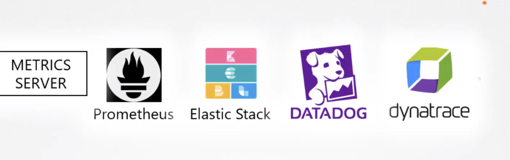

# 03 - Logging & Monitoring

- [03 - Logging & Monitoring](#03---logging--monitoring)
  - [Monitor Cluster Components](#monitor-cluster-components)
    - [Heapster vs. Metrics Server](#heapster-vs-metrics-server)
  - [Managing Application Logs](#managing-application-logs)

---

## Monitor Cluster Components

  

<br/>

### Heapster vs. Metrics Server

- Heapster (deprated)

- Metrics Server
  - In memory
  - No hisotrical metrics!

<br/>

Kubelet has a **cAdvisor** for getting the metrics in Pods and expose it via `kubectl`.

<br/>

To get Metrics Server started:

```
minikube addons enable metrics-server
```

OR

```
git clone https://github.com/kubernetes-incubator/metrics-server
kubectl create -f deploy/1.8+/
```

<br/>

To view metrics:

```
kubectl top node

kubectl top pod
```

<br/>

---

## Managing Application Logs

A pod for generating random events:

```
docker run kodekloud/event-simulator
```

<br/>

When using docker in detached mode, the docker output will not be shown in stdout. To view logs:

```
docker logs -f <container_id>
```

<br/>

For K8S, you can view logs using:

```
kubectl logs -f event-simulator-pod
```

<br/>

If there are multiple containers in a Pod, you will have to specify the container name as well:

```
kubectl logs -f <Pod_Name> <Container_Name>
```

<br/>

