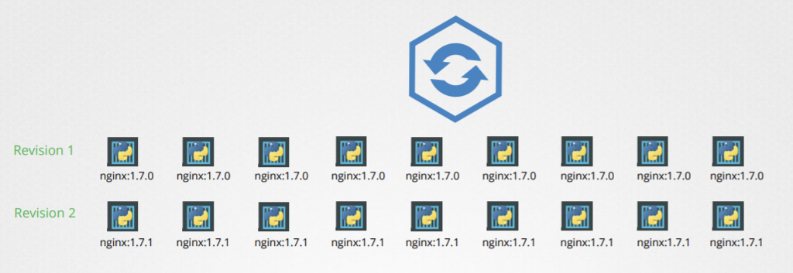
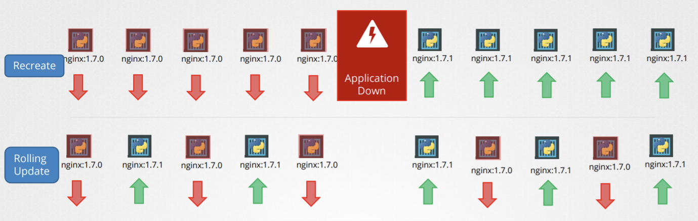
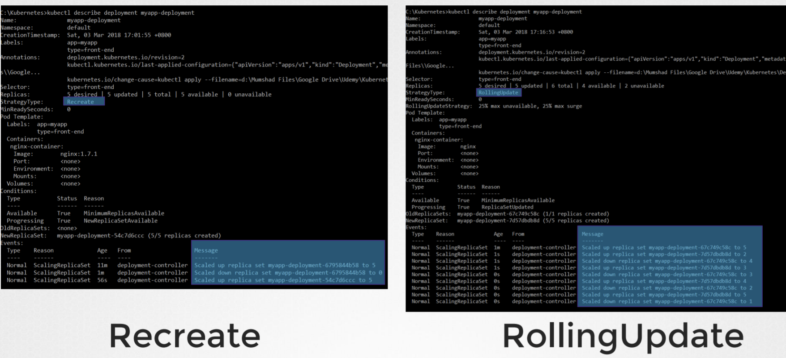
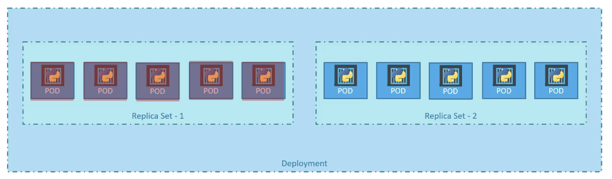
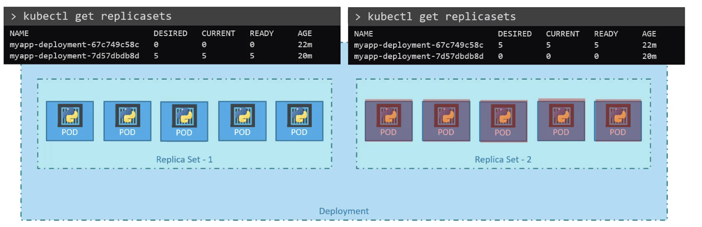

# 04 - Application Lifecycle Management

- [04 - Application Lifecycle Management](#04---application-lifecycle-management)
  - [Rolling updates and Rollbacks](#rolling-updates-and-rollbacks)
    - [Rollout Command](#rollout-command)
    - [Deployment Strategy](#deployment-strategy)
    - [Inspect deployment](#inspect-deployment)
    - [Upgrades](#upgrades)
    - [Rollbacks](#rollbacks)
  - [Summary Commands](#summary-commands)
  - [Configure Applications](#configure-applications)
    - [Commands](#commands)

---

## Rolling updates and Rollbacks

  

<br/>

### Rollout Command

To view the rollout status:

```
kubectl rollout status deployment/myapp-deployment
```

To view the rollout history:

```
kubectl rollout history deployment/myapp-deployment
```

<br/>

### Deployment Strategy

- Recreate vs. Rolling update
  - Rolling update is used by default

  

<br/>

There are 2 ways to update the deployment config.

**Option 1**

- Update the deployment definition
- `kubectl apply -f deployment-definition.yaml`

<br/>

**Option 2**

- `kubectl set image deployment/myapp-deployment nginx=nginx:1.9.1`

- This will make the deployment definition having different configuration files! Not a good practice.

<br/>

### Inspect deployment

Note the following differences when doing Recreate / Rolling updates:

  

<br/>

### Upgrades

  

```
kubectl get replicasets
```

<br/>

### Rollbacks

  

```
kubectl rollout undo deployment/myapp-deployment
```

<br/>

## Summary Commands

**Create**

```
kubectl create -f deployment-definition.yml
```

**Get**

```
kubectl get deployments
```

**Update**

```
kubectl edit deployment/<DEPLOYMENT_NAME>

kubectl apply -f deployment-definition.yml

kubectl set image deployment/myapp-deployment nginx=nginx:1.9.1
```

**Status**

```
kubectl rollout status deployment/myapp-deployment

kubectl rollout history deployment/myapp-deployment
```

**Rollback**

```
kubectl rollout undo deployment/myapp-deployment
```

<br/>

---

## Configure Applications

### Commands

Recall in `docker`, we run ubuntu using:

```
docker run ubuntu
```

However it exits automatically and goes to `EXITED` state. (Check using `docker ps`)

<br/>

In typical docker files, we often see `CMD["<COMMAND>"]`. For ubuntu case, it is `bash`.

<br/>

To prevent the container from exiting, give a specific command like `sleep 10`.

```
FROM Ubuntu
CMD sleep 5
```

OR

```
FROM Ubuntu
CMD ["sleep", "5"]
```

Then do `docker build -t ubuntu-sleeper .`, `docker run ubuntu-sleeper`

<br/>

We can also override the `CMD` at runtime by: `docker run ubuntu-sleeper sleep 10`.

However, it would be better if we only require the user to input the number and avoid the `sleep` command. To do so, when building the image, use `ENTRYPOINT`:

```
FROM Ubuntu
ENTRYPOINT ["sleep"]
```

Then when running:

```
docker run ubuntu-sleeper 10
```

<br/>

To give a default value:

```
FROM Ubuntu
ENTRYPOINT ["sleep"]
CMD ["5"]
```

> Command at startup: `sleep 5`

<br/>

If you want to override the default entrypoint, using the `--entrypoint` argument:

```
docker run --entrypoint sleep_another ubuntu-sleeper 10
```

<br/>

